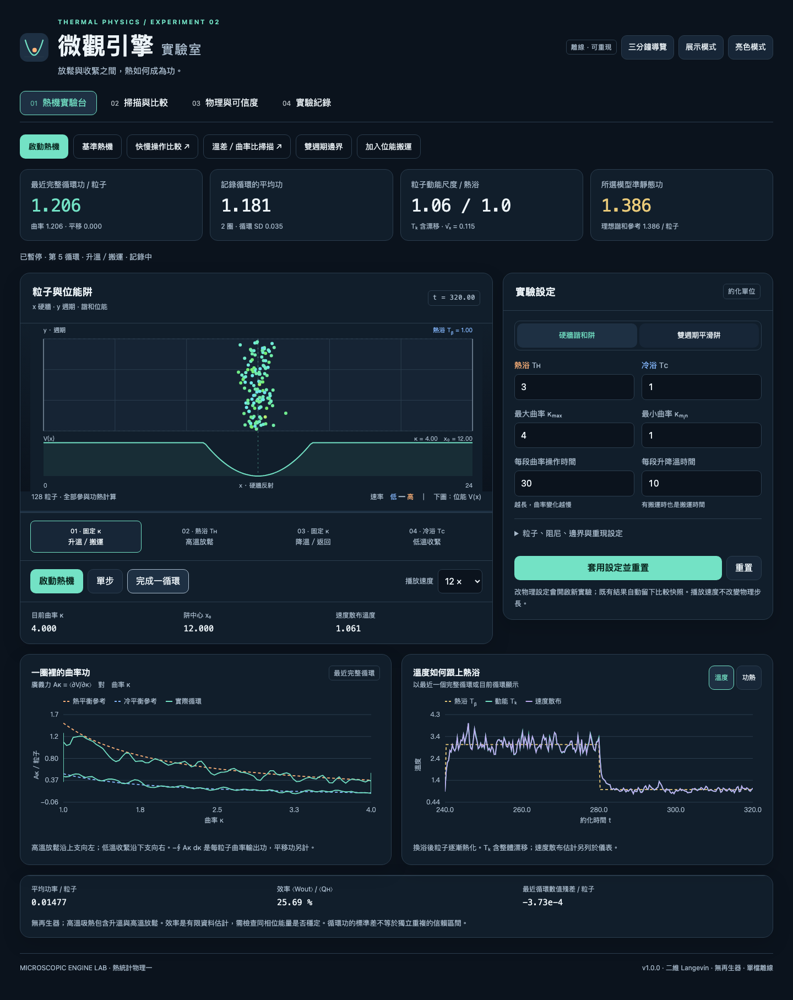

# 微觀引擎｜Microscopic Engine Lab

熱統計物理一的單檔互動實驗室。以真正的 Langevin 動力學，探索曲率控制、熱浴、平移成本、有限速度與週期邊界。

**提交與執行只需 `index.html`。直接用瀏覽器開啟，首次完全離線也可使用；不需安裝、build、伺服器或帳號。**



## 快速開始

1. 開啟 `index.html`，按第一屏的「啟動熱機」。
2. 前 2 圈為暖機；之後觀察每粒子循環功與平均功。按「完成一循環」可精確停在循環端點。
3. 按「加入位能搬運」，查看曲率功、平移功與淨功；搬運過快可能使淨功變負。
4. 「掃描與比較」提供溫差、曲率比、操作時間、曲率尺度、搬運速度及邊界六組實驗。
5. 「物理與可信度」可啟動固定阱平衡實驗，對比位置／速度分布及理論。
6. 關閉前到「實驗紀錄」儲存 JSON。CSV 保存逐循環原始資料，PNG 保存圖表。

## 模型與重要區別

- N 個二維非交互作用粒子，保留慣性的 Langevin 方程，BAOAB 分裂積分。
- 全域均勻冷熱浴依循環階段切換，並非空間溫度梯度；沒有強制速度縮放。
- 硬牆模式：x 彈性反射、y 週期、諧和位能。
- 雙週期模式：x、y 週期、平滑餘弦位能；不是只把諧和座標 modulo。
- 曲率功與平移功獨立累積；熱量取自熱浴子步動能變化，數值殘差另列。
- 無再生器，效率納入升溫及 y 方向動能吸熱；不直接套用 Carnot 效率。
- 主畫面相鄰循環的 SD 不是獨立重複的信賴區間。掃描誤差棒來自獨立重複平均的 95% t 區間。
- 所有數值採約化單位，m = kB = 1，Ly = 12。

## 操作與資料

- 播放、暫停、物理單步、循環端點停止、相同種子重置。
- 修改物理參數時開啟新實驗，自動保存舊結果快照；播放速度不改 dt。
- 曲率循環圖、溫度／功熱曲線、位置與速度分布、掃描與殘差圖。
- 暗／亮模式、展示模式、手機排版、鍵盤分頁、圖表鍵盤讀值、三分鐘導覽。
- POE、可複製探究提示詞、CSV／PNG／JSON、最多 6 組比較快照。
- JSON 包含粒子、積分相位、功熱帳本、PRNG 當前狀態與高斯備用樣本，載入後可沿同一軌跡續跑。
- 背景頁面自動暫停主實驗；已啟動的批次掃描仍可在 Worker 執行。Worker 不可用時採同一核心的分批備援。
- 取消保留已完成的掃描點，未完成點不進入擬合。每點的種子、排程、dt 與原始循環皆能匯出。

`index.html` 同時是可維護原始碼，包含 `engine-styles`、`engine-core`、`engine-jobs`、`engine-app`。沒有必需的相鄰檔案、CDN 或第三方執行套件。所有圖表以原生 Canvas 繪製；公式以原生文字與上下標排版，避免字型或數學套件的離線依賴。

## 文件與開發測試

- [物理模型](docs/physics-models.md)
- [數值與統計](docs/numerical-methods.md)
- [評分對照](docs/rubric-mapping.md)
- [驗證結果與限制](docs/validation.md)
- [三分鐘展示](docs/demo-script.md)
- [來源與授權](docs/third-party-notices.md)

測試直接從交付 HTML 擷取核心或透過 UI 操作，不測另一份數值實作。執行模擬器本身不需要 Node 或 Playwright。

```sh
node tests/numerical.cjs
PLAYWRIGHT_MODULE=/absolute/path/to/playwright node tests/browser.cjs
PLAYWRIGHT_MODULE=/absolute/path/to/compatible/playwright ENGINE_BROWSER=webkit node tests/browser.cjs
```

可用 `ENGINE_TEST_OUTPUT` 指定測試輸出目錄，預設為 `test-results/`。完整數值測試包含每點 20 次重複的正式掃描，需要較長時間。WebKit 測試環境與離線隔離方式詳見驗證紀錄。

支援的輸入上限不代表所有極端組合都接近準靜態。大曲率、低溫、窄容器、快速搬運或熱化不足，都可能明顯偏離理想公式；頁面保留這些結果供研究。
